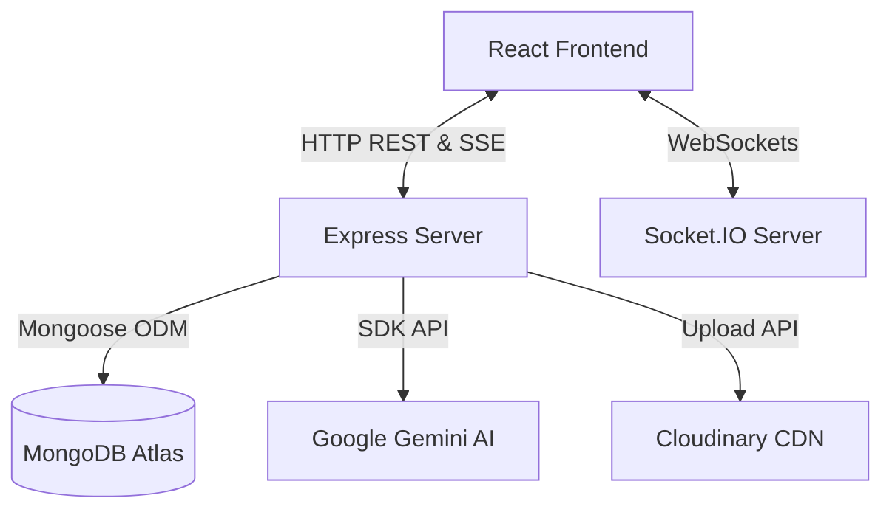

# SharedSpace AI

SharedSpace AI is a modern, real-time collaboration platform and intelligent workspace assistant. It enables teams to communicate seamlessly in dedicated virtual workspaces (spaces), share files, manage pinned and starred messages, and collaborate directly with a persistent AI assistant integrated directly into their chats.

---

## Features

*   **Real-Time Workspace Chat**: Seamless messaging with real-time delivery powered by Socket.IO.
*   **AI Assistant (1-to-1)**: Private chat with the AI assistant featuring persistent history, context memory, and automatic memory summary consolidation.
*   **@AI Workspace Mentions**: Invoke the AI assistant directly inside group spaces by typing `@AI`. The assistant responds with context aware of recent workspace conversation logs.
*   **Invite Links**: Generate space invite links with configurable usage limits (5, 10, or unlimited members) and built-in joining validation.
*   **File Sharing**: Upload and share images and videos securely, supported by dual-layer file type validation and automated Cloudinary uploads.
*   **Message Reactions**: Express yourself with real-time emoji reactions, featuring a responsive, touch-friendly bottom sheet for mobile users.
*   **Pin Messages**: Pin important messages within a workspace to keep them accessible to all space members.
*   **Starred Messages**: Bookmark individual messages for quick personal reference.
*   **Light/Dark Theme**: User-selectable and persistent theme management (Dark & Light modes), built directly into application settings.
*   **Security Hardening**: Hardened routes, input validation schemas, unexpected request fields rejection, path parameter checks, and strict rate-limiting on all key operations.

---

## Tech Stack

*   **Frontend**: React (Vite), Zustand, Tailwind CSS, Framer Motion, Socket.IO Client.
*   **Backend**: Node.js, Express, Socket.IO, Mongoose, MongoDB Atlas.
*   **Services**: Google Gemini AI (via `@google/generative-ai`), Cloudinary (Media storage).

---

## Screenshots

*Screenshots demonstrating the interface and features:*

| Landing Page | Workspace Chat |
|:---:|:---:|
|  |  |

| AI Assistant (1-on-1) | Application Settings |
|:---:|:---:|
|  |  |

---

## Architecture Overview



*   **Frontend Layer**: A fast React SPA styled with Tailwind CSS, managing application state globally with Zustand. Websockets are used for messaging events, and Server-Sent Events (SSE) stream AI responses.
*   **Backend Layer**: Express handles routing, middleware authentication, upload streams, and API keys. Socket.IO manages rooms, client socket mappings, typing status, and real-time state sync.
*   **Database & Services**: MongoDB Atlas hosts database profiles. The Google Gemini API powers AI reasoning, and Cloudinary hosts user avatars, uploaded images, and shared videos.

---

## Project Structure

```text
SharedSpace AI/
├── client/                 # React Frontend Application
│   ├── public/             # Static Assets & Icons
│   ├── src/
│   │   ├── assets/         # App CSS & Logo Assets
│   │   ├── components/     # Reusable layout and modal components
│   │   ├── pages/          # View screens (Space, AIChat, Dashboard, Auth)
│   │   ├── services/       # API and socket connection helpers
│   │   ├── stores/         # Zustand global state management
│   │   ├── main.jsx        # Frontend entry point
│   │   └── App.jsx         # App router and theme provider
│   └── package.json
│
├── server/                 # Express Backend Application
│   ├── src/
│   │   ├── config/         # MongoDB connection setup
│   │   ├── controllers/    # API Request handlers (auth, spaces, upload)
│   │   ├── middleware/     # JWT Auth, validation, & rate limiters
│   │   ├── models/         # Mongoose Schemas (User, Space, Message, Invite)
│   │   ├── routes/         # Express endpoint definitions
│   │   ├── services/       # Cloudinary and Gemini API services
│   │   ├── sockets/        # Socket.IO connection and workspace event handling
│   │   └── index.js        # Server startup and middleware setup
│   └── package.json
└── README.md
```

---

## Installation Steps

### Prerequisites
*   Node.js (v18 or higher)
*   npm (v9 or higher)
*   MongoDB Database (local instance or MongoDB Atlas URL)
*   Cloudinary Account
*   Google Gemini API Key

### Clone the Repository
```bash
git clone https://github.com/your-username/sharedspace-ai.git
cd sharedspace-ai
```

### Server Installation
1. Navigate to the server folder:
   ```bash
   cd server
   ```
2. Install dependencies:
   ```bash
   npm install
   ```
3. Create a `.env` file from the example:
   ```bash
   cp .env.example .env
   ```
4. Populate the `.env` variables with your credentials (see variables details below).

### Client Installation
1. Navigate to the client folder (from the project root):
   ```bash
   cd client
   ```
2. Install dependencies:
   ```bash
   npm install
   ```
3. Create a `.env` file:
   ```bash
   VITE_API_URL=http://localhost:5000/api
   VITE_SOCKET_URL=http://localhost:5000
   ```

---

## Environment Variables

### Backend Configuration (`server/.env`)

| Variable | Description | Example Value |
| :--- | :--- | :--- |
| `PORT` | The port the backend server listens on | `5000` |
| `NODE_ENV` | Mode of operation (`development` or `production`) | `development` |
| `MONGODB_URI` | MongoDB Atlas or Local connection URI | `mongodb+srv://...` |
| `JWT_SECRET` | Secret key used to sign and verify JWT tokens | `your_jwt_secret_key` |
| `JWT_EXPIRE` | Expiry duration for authentication tokens | `7d` |
| `CLOUDINARY_CLOUD_NAME` | Cloudinary Storage Cloud Name | `my_cloud_name` |
| `CLOUDINARY_API_KEY` | Cloudinary API Key credential | `1234567890` |
| `CLOUDINARY_API_SECRET` | Cloudinary API Secret key | `api_secret_key` |
| `GEMINI_API_KEY` | API Key for Google Gemini services | `gemini_api_key` |
| `CLIENT_URL` | Cross-Origin Request Allowed Client origin | `http://localhost:5173` |

### Frontend Configuration (`client/.env`)

| Variable | Description | Default Value |
| :--- | :--- | :--- |
| `VITE_API_URL` | Express REST server base endpoint | `http://localhost:5000/api` |
| `VITE_SOCKET_URL` | Socket.IO server base server URL | `http://localhost:5000` |

---

## Running Locally

To run the application locally, you will need to start both the backend server and the frontend Vite server.

### Start the Backend Server
```bash
cd server
npm run dev
```
The server will start on port `5000`. You should see `MongoDB Connected` and `Gemini API connection validated successfully.` in the terminal logs.

### Start the Frontend Dev Server
```bash
cd client
npm run dev
```
The Vite development server will start, typically hosting the UI at `http://localhost:5173`. Open this URL in your browser to access SharedSpace AI.

---

## Security Features

The application incorporates advanced security reviews and hardening measures to prepare it for secure cloud deployment:

1.  **Strict Request Validation**: Every API route implements schema parsing middleware that verifies variable data types, limits string inputs to prevent overflow, and strictly rejects unexpected request parameters.
2.  **Path and Parameter Integrity**: All URL routing variables (e.g. workspace and user IDs) are validated using strict ObjectId checks (`validateMongoIdParam`) to block casting errors or NoSQL injections. Active invite tokens are verified using specific UUID regex rules.
3.  **Authentication and Access Control**: JSON Web Tokens are validated securely on every REST request and socket handshake. Socket rooms enforce workspace boundaries, blocking users from listening to typing triggers, receiving messages, or sending emojis in spaces where they are not registered.
4.  **Multi-Channel Rate Limiting**:
    *   `loginRegisterLimiter`: Limits login and registration endpoints to a maximum of 20 attempts per 15 minutes.
    *   `inviteLimiter`: Limits invite verification attempts to 30 requests per 15 minutes.
    *   `aiRestLimiter` / Socket Rate Limiters: Restricts AI queries to 20 per minute per client.
5.  **Secure Upload Filters**: Shared files are double-validated on the server. Memory buffers are analysed to check both the MIME type headers and extension whitelist patterns, restricting payload sizes to 20MB.

---

## Deployment Instructions

### Deploying the Backend
The server is structured to be compatible with hosting providers such as Render, Heroku, or AWS Elastic Beanstalk.
1.  Set the `NODE_ENV` environment variable to `production`.
2.  Set the correct `CLIENT_URL` corresponding to your deployed frontend host.
3.  Add all required environment variables (`MONGODB_URI`, `JWT_SECRET`, `GEMINI_API_KEY`, etc.) inside the hosting provider's dashboard configuration panels.

### Deploying the Frontend
The client can be built as static files and deployed to Vercel, Netlify, or AWS S3.
1.  Configure the production endpoints in the client environment variables (`VITE_API_URL`, `VITE_SOCKET_URL`).
2.  Run the build command:
    ```bash
    npm run build
    ```
3.  Deploy the generated `dist/` directory files to your host.

---

## Future Improvements

*   **HTTP-Only Cookies**: Move JWT storage from `localStorage` to secure `HttpOnly` and `SameSite` cookies to protect authentication credentials against potential XSS vectors.
*   **Redis-Backed Sockets**: Implement a Redis Adapter (`@socket.io/redis-adapter`) to synchronise socket states and user listings across multiple scaled server instances.
*   **Multi-Instance Rate Limiting**: Integrate Redis store backings to coordinate rate limit counts globally instead of in-memory instance Maps.
*   **Audio/Video Channels**: Integrate WebRTC channels for voice and video space rooms.

---

## Author

**SharedSpace AI Team** - *Collaborative environments with artificial intelligence.*
